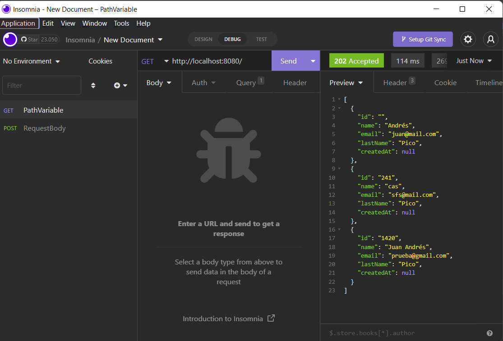
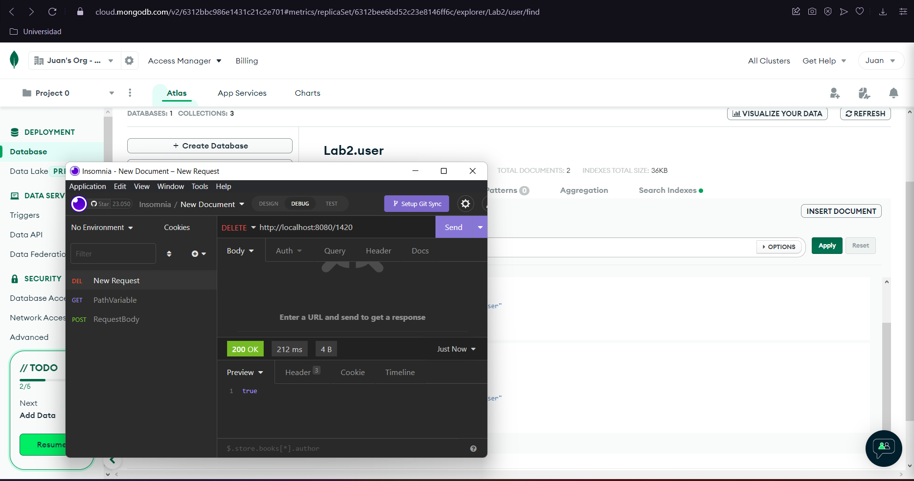
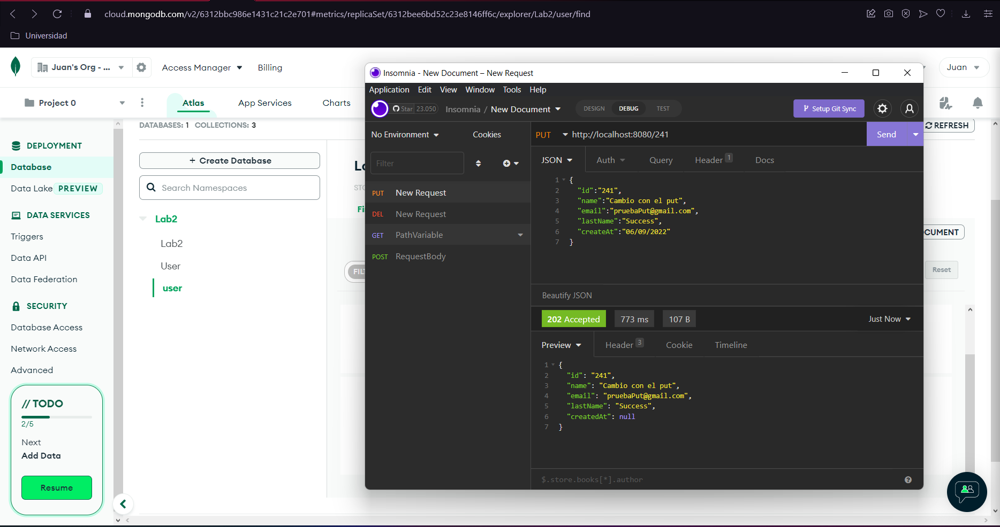

# Lab 3 
En este laboratorio se busca conocer la integración de MongoDB con SpringBoot
y ver los cambios reflejados en la base de datos con tipo JSON.

## agregar un usuario a la base de datos

## buscar a un usuario por su id 

## buscar todos los usuarios en la base de datos 

## Eliminar un usuario segun su id

## Update

